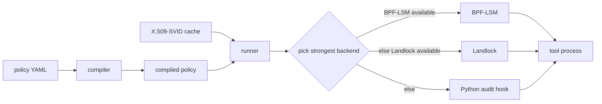

# Least-Privilege Agent Sandbox

[](https://github.com/least-privilege-agent-sandbox/least-privilege-agent-sandbox/actions/workflows/ci.yml)
[](https://github.com/least-privilege-agent-sandbox/least-privilege-agent-sandbox/actions/workflows/formal.yml)

Least-Privilege Agent Sandbox runs AI-agent tool calls under a compiled YAML policy, an X.509-SVID cache, and the strongest backend available on the host.

Python audit hooks are cooperative process-local checks, not a security boundary. Use Landlock or BPF-LSM where kernel enforcement is available.

## Why I built this

Tool runners often receive more filesystem, process, and network authority than a single step needs. I wanted a small runner that treats a tool call as an untrusted process and starts from deny-by-default policy.

The project keeps one policy format across development laptops and Linux hosts. The runner validates the SPIFFE identity, compiles policy once, caches SVID results, and then chooses the strongest backend the host can support.

## How it works



A policy maps SPIFFE subjects to allowed tools, filesystem roots, executables, network destinations, and maximum argument bytes. Backend selection is ordered BPF-LSM, then Landlock, then the audit-hook shim. The current runner falls back from BPF-LSM to Landlock or audit hooks unless a subject requires a kernel backend.

| Backend | Boundary | Where it works | Status |
|---|---|---|---|
| BPF-LSM | Kernel LSM hooks for open, exec, and connect | Linux booted with the BPF LSM enabled and a loader with the needed privileges | Prototype C program and Python loader are present. Runtime enforcement was not measured on GitHub runners or the reference host. The VM workflow is manual-only. |
| Landlock | Kernel-enforced process restrictions | Linux kernels with Landlock enabled; GitHub Ubuntu runners usually expose it, and tests skip only when the kernel does not | Real filesystem corpus denied 335/335 forbidden operations and allowed 155/155 permitted operations. Network rules depend on Landlock ABI level. |
| Python audit hook | Cooperative in-process checks | CPython on Linux, macOS, and Windows | Useful for development and tests. It is not a security boundary against native code or a process that avoids audited APIs. |

## Quickstart

Linux/macOS:

```bash
python -m venv .venv
. .venv/bin/activate
python -m pip install -e ".[dev]"
python - <<'PY'
import sys
from least_privilege_agent_sandbox.policy import Policy
from least_privilege_agent_sandbox.runner import run_tool

policy = Policy.from_dict({"subjects": {"spiffe://ztap.test/agent/demo": {
    "allowed_tools": ["exec"],
    "fs": {"read": ["."], "write": ["."]},
    "executables": [sys.executable],
}}})
result = run_tool("spiffe://ztap.test/agent/demo", "exec", [sys.executable, "-c", "print('ok')"], policy=policy)
print(result.backend, result.stdout.strip())
PY
bash scripts/check.sh
```

Windows PowerShell:

```powershell
py -3.12 -m venv .venv
.\.venv\Scripts\python -m pip install -e ".[dev]"
.\.venv\Scripts\python -m pytest -q -m "not integration"
```

The CLI path validates a PEM SVID and trust bundle before calling the same runner:

```bash
least-privilege-agent-sandbox run --policy examples/policy.yaml --svid agent.pem --trust-bundle ca.pem -- python -c "print('ok')"
```

## What I measured

Reference microbenchmark run: `results/20260925T211429Z-a01d479f` on Linux aarch64 in Docker `python:3.12-slim` with 100 trials. Landlock corpus: `results/landlock-corpus` with 490 filesystem operations. Zero Trust Agent Benchmark artifacts: `results/azt-dev` and `results/azt-test`, dataset `zero-trust-agent-benchmark-dataset-v4`, test file sha256 `4f6fff41fe77aefb2ec96336b65a58d571986e0036ac3e368cc9975ed029dfc7`. Rates use Wilson intervals over distinct traces or operations.

| Claim tested | Outcome | Result |
|---|---|---:|
| H1 decision p50 < 3 ms | Met | p50 60.25 µs; p95 107.68 µs |
| H2 Landlock per-open overhead p95 < 5 µs | Not met | p50 0.68 µs; p95 194.67 µs; p99 261.75 µs; mean 6.42 µs |
| H3 Landlock denies forbidden filesystem operations | Met | 335/335 denied; 155/155 permitted operations allowed |
| H4 BPF-LSM overhead | Inconclusive | BPF-LSM runtime was not available locally and has not been measured on GitHub runners |

Zero Trust Agent Benchmark v4 test split:

| Slice | Block rate | False-positive rate | Leaks |
|---|---:|---:|---:|
| Overall | 373/500 = 74.6% [70.6%, 78.2%] | 4/500 = 0.8% [0.3%, 2.0%] | 0/1000 |
| In-policy attacks | 130/250 = 52.0% [45.8%, 58.1%] | N/A | 0/250 |
| Out-of-policy attacks | 243/250 = 97.2% [94.3%, 98.6%] | N/A | 0/250 |

Local validation recorded in the artifacts: Windows `pytest -m "not integration"` passed with 116 tests and 92.70% coverage. Docker with `ZTAP_INTEGRATION=1` passed with 113 tests and 92.87% coverage. TLC passed the main `LayeredEnforcement` config with 472,637 generated states, 113,442 distinct states, and depth 17; the cooperative-only config produced the expected counterexample.

## Limitations

The audit-hook backend is cooperative. It is for development and compatibility, not isolation from arbitrary native code.

Landlock support depends on kernel version and ABI level. Filesystem restrictions are broadly available on current Linux hosts; TCP connect restrictions require a newer ABI.

The BPF-LSM backend is a prototype. I keep its GitHub workflow manual-only until runtime enforcement passes on a host booted with BPF-LSM.

Least privilege does not decide whether a tool call is semantically safe. In-policy attacks can still pass when they stay inside the configured authority and do not carry recognizable secret material.

## Related projects

- [Zero Trust Agent Benchmark](https://github.com/zero-trust-agent-benchmark/zero-trust-agent-benchmark): shared trace generator and scorer for the related projects.
- [Contextual Trust Policy Engine](https://github.com/contextual-trust-policy-engine/contextual-trust-policy-engine): evaluates contextual policy decisions before tools run.
- [Zero Trust AI Agent Proxy](https://github.com/zero-trust-ai-agent-proxy/zero-trust-ai-agent-proxy): proxy layer for checking tool requests at a service boundary.
- [Model Context Protocol Guard](https://github.com/model-context-protocol-guard/model-context-protocol-guard): validates MCP tool metadata and calls.
- [Ephemeral Agent Secret Leasing](https://github.com/ephemeral-agent-secret-leasing/ephemeral-agent-secret-leasing): issues short-lived scoped secrets to agents.
- [AI Bill of Materials Verifier](https://github.com/ai-bill-of-materials-verifier/ai-bill-of-materials-verifier): verifies signed AI-BOM metadata for models, prompts, tools, and datasets.
- [Zero Trust Edge Agent Mesh](https://github.com/zero-trust-edge-agent-mesh/zero-trust-edge-agent-mesh): coordinates policy and identity checks across edge agents.

## License

Apache-2.0. See `LICENSE`. Citation metadata is in `CITATION.cff` as a software citation.
