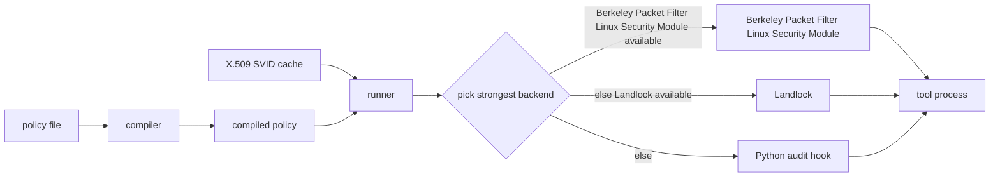

<p align="center"></p>

# Least-Privilege Agent Sandbox

[](https://github.com/least-privilege-agent-sandbox/least-privilege-agent-sandbox/actions/workflows/ci.yml)
[](https://github.com/least-privilege-agent-sandbox/least-privilege-agent-sandbox/actions/workflows/formal.yml)

Least-Privilege Agent Sandbox runs agent tool calls under a compiled policy file, an X.509 cache for Secure Production Identity Framework for Everyone (SPIFFE) Verifiable Identity Documents (SVIDs), and the strongest backend available on the host.

Python audit hooks are cooperative process-local checks, not a security boundary. Use Landlock or the Berkeley Packet Filter Linux Security Module (BPF-LSM) where kernel enforcement is available.

## Why I built this

Tool runners often receive more filesystem, process, and network authority than a single step needs. I wanted a small runner that treats a tool call as an untrusted process and starts from deny-by-default policy.

The project keeps one policy format across development laptops and Linux hosts. The runner validates the SPIFFE identity, compiles policy once, caches SVID results, and then chooses the strongest backend the host can support.

## How it works



A policy maps SPIFFE subjects to allowed tools, filesystem roots, executables, network destinations, and maximum argument bytes. Backend selection is ordered Berkeley Packet Filter Linux Security Module, then Landlock, then the audit-hook shim. The current runner falls back to Landlock or audit hooks unless a subject requires a kernel backend.

| Backend | Boundary | Where it works | Status |
|---|---|---|---|
| Berkeley Packet Filter Linux Security Module | Kernel Linux Security Module hooks for open, exec, and connect | Linux booted with the Berkeley Packet Filter Linux Security Module enabled and a loader with the needed privileges | Prototype C program and Python loader are present. Runtime enforcement was not measured on GitHub runners or the reference host. The virtual machine workflow is manual-only. |
| Landlock | Kernel-enforced process restrictions | Linux kernels with Landlock enabled; GitHub Ubuntu runners usually expose it, and tests skip only when the kernel does not | Real filesystem corpus denied 335/335 forbidden operations and allowed 155/155 permitted operations. Network rules depend on Landlock application binary interface level. |
| Python audit hook | Cooperative in-process checks | CPython on Linux, macOS, and Windows | Useful for development and tests. It is not a security boundary against native code or a process that avoids audited application programming interfaces. |

## Quickstart

Linux/macOS:

```bash
python -m venv .venv
. .venv/bin/activate
python -m pip install -e ".[dev]"
python - <<'PY'
import sys
from least_privilege_agent_sandbox.policy import Policy
from least_privilege_agent_sandbox.runner import run_tool

policy = Policy.from_dict({"subjects": {"spiffe://example.org/agent/demo": {
    "allowed_tools": ["exec"],
    "fs": {"read": ["."], "write": ["."]},
    "executables": [sys.executable],
}}})
result = run_tool("spiffe://example.org/agent/demo", "exec", [sys.executable, "-c", "print('ok')"], policy=policy)
print(result.backend, result.stdout.strip())
PY
bash scripts/check.sh
```

Windows PowerShell:

```powershell
py -3.12 -m venv .venv
.\.venv\Scripts\python -m pip install -e ".[dev]"
.\.venv\Scripts\python -m pytest -q -m "not integration"
```

The command-line interface path validates a Privacy-Enhanced Mail encoded SVID and trust bundle before calling the same runner:

```bash
least-privilege-agent-sandbox run --policy examples/policy.yaml --svid agent.pem --trust-bundle ca.pem -- python -c "print('ok')"
```

## What I measured

Reference microbenchmark run: `results/20260925T211429Z-a01d479f` on Linux aarch64 in Docker `python:3.12-slim` with 100 trials. Landlock corpus: `results/landlock-corpus` with 490 filesystem operations. Zero Trust Agent Benchmark artifacts: `results/benchmark-dev` and `results/benchmark-test`, dataset `zero-trust-agent-benchmark-dataset-v4.1`, test file sha256 `d065bab9bed145490579cd7add6a574c6e23c21c0ea4525dc1c14b0fc15acd2b`. Rates use Wilson intervals over distinct traces or operations.

| Claim tested | Outcome | Result |
|---|---|---:|
| Decision latency target | Met | Median 60.25 µs; 95th percentile 107.68 µs |
| Landlock open overhead target | Not met | Median 0.68 µs; 95th percentile 194.67 µs; 99th percentile 261.75 µs; mean 6.42 µs |
| Landlock filesystem denial target | Met | 335/335 denied; 155/155 permitted operations allowed |
| Berkeley Packet Filter Linux Security Module overhead target | Inconclusive | Runtime enforcement was not available locally and has not been measured on GitHub runners |

Zero Trust Agent Benchmark v4.1 official evaluator results:

| Test setting | Block rate | In-policy block rate | Out-of-policy block rate | False positive rate | Leak rate |
|---|---:|---:|---:|---:|---:|
| Issued secrets provided | 500/500 = 100.0% [99.2%, 100.0%] | 250/250 = 100.0% [98.5%, 100.0%] | 250/250 = 100.0% [98.5%, 100.0%] | 4/500 = 0.8% [0.3%, 2.0%] | 0/1000 = 0.0% [0.0%, 0.4%] |
| Issued secrets withheld | 468/500 = 93.6% [91.1%, 95.4%] | 218/250 = 87.2% [82.5%, 90.8%] | 250/250 = 100.0% [98.5%, 100.0%] | 4/500 = 0.8% [0.3%, 2.0%] | 32/1000 = 3.2% [2.3%, 4.5%] |

Ablation on the test split:

| Version | Defense increment | Block rate | False positive rate | Leak rate | 95th percentile latency |
|---|---|---:|---:|---:|---:|
| Version 1 | Static profile, egress checks, and issued-secret data loss prevention | 373/500 = 74.6% [70.6%, 78.2%] | 4/500 = 0.8% [0.3%, 2.0%] | 0/1000 = 0.0% [0.0%, 0.4%] | 0.575 ms [0.531, 0.642] |
| Final | Adds task-derived authority, requester checks for untrusted effects, session escalation checks, taint from tool outputs and retrieved documents, destructive-query checks, control-token handling, and canonicalisation before policy evaluation | 500/500 = 100.0% [99.2%, 100.0%] | 4/500 = 0.8% [0.3%, 2.0%] | 0/1000 = 0.0% [0.0%, 0.4%] | 0.412 ms [0.400, 0.435] |

Local validation: Windows `ruff check .`, `ruff format --check .`, `mypy src`, and `pytest -q -m "not integration" --cov=least_privilege_agent_sandbox --cov-report=term-missing --cov-fail-under=90` passed with 138 tests and 97.12% coverage. The no-label regression test, benchmark literal guard, official-count reproducibility test, and adversarial Hypothesis tests are included in the suite. The Temporal Logic of Actions Plus model checker passed the main `LayeredEnforcement` config with 472,637 generated states, 113,442 distinct states, and depth 17; the cooperative-only config produced the expected counterexample.

## Limitations

The audit-hook backend is cooperative. It is for development and compatibility, not isolation from arbitrary native code.

Landlock support depends on kernel version and application binary interface level. Filesystem restrictions are broadly available on current Linux hosts; Transmission Control Protocol connect restrictions require a newer application binary interface.

The Berkeley Packet Filter Linux Security Module backend is a prototype. I keep its GitHub workflow manual-only until runtime enforcement passes on a host booted with that module.

Least privilege does not decide whether a tool call is semantically safe. In-policy attacks can still pass when they stay inside the configured authority and do not carry recognizable secret material.

## License

Apache-2.0. See `LICENSE`. Citation metadata is in `CITATION.cff` as a software citation.
